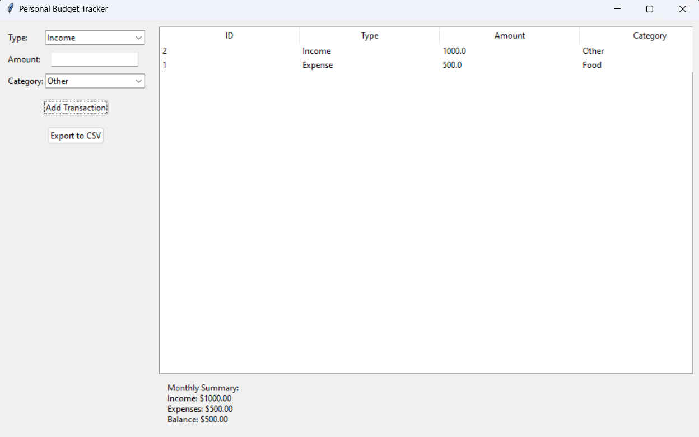

# Personal Budget Tracker

A simple desktop application to track personal income and expenses.

## 🖼️ Screenshot

### Main Screen



## Features

- Add income and expenses with categories
- View transaction history in a table
- Monthly summary of income and expenses
- Export transaction data to CSV
- SQLite database for data persistence

## Requirements

- Python 3.x
- tkinter (usually comes with Python)
- matplotlib (for charts)
- sqlite3 (usually comes with Python)

## Installation

1. Clone this repository
2. Install the required packages:
   ```bash
   pip install matplotlib
   ```

## Usage

1. Run the application:
   ```bash
   python tracker.py
   ```

2. Add transactions:
   - Select transaction type (Income/Expense)
   - Enter the amount
   - Select a category
   - Click "Add Transaction"

3. View your transactions in the table on the right

4. Export your data:
   - Click "Export to CSV" to save all transactions to a CSV file

## Project Structure

- `tracker.py`: Main application with GUI
- `db.py`: Database operations

## Categories

The application comes with predefined categories:
- Food
- Transport
- Entertainment
- Bills
- Shopping
- Other 

